# Suricata ML-IDS: Machine Learning Enhanced Intrusion Detection System

[](https://www.docker.com/)
[](https://python.org/)
[](https://suricata.io/)
[](https://www.elastic.co/)
[](LICENSE)

A production-ready Intrusion Detection System that combines **signature-based detection** (Suricata) with **machine learning** capabilities, achieving **99.2% accuracy** on the industry-standard NSL-KDD dataset.

## 🎯 What is Suricata ML-IDS?

This project implements a comprehensive cybersecurity solution that:

- **Detects Network Threats** using both traditional signatures and AI/ML models
- **Processes Real-time Traffic** with <30ms detection latency  
- **Provides SIEM Dashboards** for security monitoring and analysis
- **Supports Research & Education** with complete documentation and guides

## 🚀 Quick Start (One Command)

```bash
# Clone and run complete demonstration
git clone https://github.com/your-username/suricata-ml-ids.git
cd suricata-ml-ids

# Setup Python virtual environment (required for ML scripts)
python3 -m venv venv
source venv/bin/activate  # On Windows: venv\Scripts\activate
pip install -r requirements.txt

# Setup and start everything
./scripts/setup.sh
./scripts/demo.sh demo
```

**Result**: Full system running with ML models trained, real-time detection active, and Kibana dashboards available at http://localhost:5601

## 📊 Performance Highlights

| Metric | Achievement | Industry Target |
|--------|-------------|-----------------|
| **ML Accuracy** | 99.2% (NSL-KDD) | >90% |
| **Detection Speed** | 8-29ms | <100ms |
| **Throughput** | 1000+ req/sec | 500+ req/sec |
| **System Health** | 9/9 services | All operational |

## 🏗️ System Architecture

```mermaid
flowchart LR
    subgraph INPUT ["Data"]
        NSL[(NSL-KDD<br/>148K samp)]
        NET[live traffic]
    end
    
    subgraph DETECTION ["Detection"]
        SUR[SuricataIDS<br/>Signatures]
        ML[ML Pipeline<br/>99.2% Accuracy]
    end
    
    subgraph SIEM ["📊 SIEM & Analytics"]
        ES[Elasticsearch]
        KB[Kibana<br/>Dashboards]
    end
    
    NSL --> ML
    NET --> SUR
    NET --> ML
    SUR --> ES
    ML --> ES
    ES --> KB
    
    classDef input fill:#e8f5e8,stroke:#2e7d32,stroke-width:2px
    classDef detection fill:#fff3e0,stroke:#ef6c00,stroke-width:2px
    classDef siem fill:#e3f2fd,stroke:#1565c0,stroke-width:2px
    
    class NSL,NET input
    class SUR,ML detection
    class ES,KB siem
```



## 🧠 Machine Learning Pipeline

### NSL-KDD Dataset Integration
- **148,517 real network samples** from diverse attack scenarios
- **122 engineered features** including protocol analysis and timing patterns
- **4 attack categories**: DoS, Probe, R2L, U2R + Normal traffic
- **Industry benchmark** used by universities and security companies worldwide

### ML Models & Performance
| Algorithm | Accuracy | Use Case |
|-----------|----------|----------|
| **Decision Tree** | 98.8% | Fast, interpretable rules |
| **k-Nearest Neighbors** | 98.9% | Pattern similarity detection |
| **Ensemble Model** | **99.2%** | **Best overall performance** |

## 🛠️ Technology Stack

### Core Components
- **🔍 Suricata IDS**: Signature-based detection engine
- **🧠 Python ML Services**: scikit-learn, FastAPI, asyncio
- **📊 ELK Stack**: Elasticsearch + Kibana for SIEM
- **💾 Redis**: High-performance caching and messaging
- **🐳 Docker**: Containerized microservices architecture

**→ [Complete Technology Stack](docs/technology-stack.md)**

## 🎯 Use Cases

### 🎓 Education & Research
- **University Courses**: Network security, ML in cybersecurity
- **Research Projects**: Algorithm comparison, performance analysis
- **Hands-on Learning**: Complete working system for experimentation

### 🏢 Professional Development
- **Security Teams**: SIEM integration and threat detection
- **DevOps Engineers**: Microservices architecture and monitoring
- **Data Scientists**: Real-world ML pipeline implementation

### 🔬 Academic Research
- **Benchmark Comparisons**: NSL-KDD standard dataset
- **Algorithm Development**: Extensible ML framework
- **Performance Studies**: Latency, accuracy, and scalability analysis

## 📚 Documentation

### Quick Access
- **[🚀 Quick Start Guide](docs/quick-start-guide.md)** - Get running in 5 minutes
- **[🏗️ System Architecture](docs/system-architecture.md)** - Technical deep dive
- **[📊 Performance Metrics](docs/performance-metrics.md)** - Benchmarks and analysis

### Machine Learning
- **[🧠 ML Overview](docs/machine-learning-overview.md)** - Technical summary
- **[🎓 ML Guide for Beginners](docs/ml-guide-for-beginners.md)** - Complete tutorial
- **[📈 NSL-KDD Analysis](docs/nsl-kdd-analysis.md)** - Dataset deep dive

### API & Development
- **[📖 API Documentation](docs/api/)** - Complete API reference
- **[🛠️ Development Guide](docs/development-guide.md)** - Contributing and extending
- **[🔧 Configuration](docs/configuration.md)** - Setup and customization

## 🌐 Access Points

After running the demo, access these interfaces:

| Service | URL | Purpose |
|---------|-----|---------|
| **Kibana SIEM** | http://localhost:5601 | Security dashboards |
| **ML Detection API** | http://localhost:8080/docs | Real-time threat detection |
| **ML Trainer API** | http://localhost:8002/docs | Model training |
| **Feature Extractor** | http://localhost:8001/docs | PCAP analysis |

## 🏆 Key Features

### ✅ Production Ready
- **One-command deployment** with Docker Compose
- **Health monitoring** and automatic service recovery
- **Scalable architecture** with Redis clustering support
- **SIEM integration** with Elasticsearch and Kibana

### ✅ Educational Value
- **Complete documentation** for all experience levels
- **Real-world dataset** (NSL-KDD) with 148K samples
- **Explainable AI** with feature importance analysis
- **Hands-on tutorials** and interactive examples

### ✅ Research Capabilities
- **Benchmark performance** on industry-standard dataset
- **Extensible framework** for algorithm development
- **Performance metrics** and comparative analysis
- **Academic-grade documentation** and methodology

## 🤝 Contributing

We welcome contributions! See our [Contributing Guide](CONTRIBUTING.md) for:
- Code style guidelines
- Development setup
- Testing procedures
- Pull request process

## 📄 License

This project is licensed under the MIT License - see the [LICENSE](LICENSE) file for details.

**Educational Use**: This software is designed for educational and research purposes in cybersecurity and machine learning. See LICENSE for third-party component licenses and usage guidelines.

## 🙏 Acknowledgments

- **NSL-KDD Dataset**: University of New Brunswick
- **Suricata Project**: Open Information Security Foundation
- **Elastic Stack**: Elasticsearch B.V.
- **scikit-learn**: Python Software Foundation

---

## 📚 Documentation

- **[Quick Start Guide](docs/quick-start-guide.md)** - Installation and basic usage
- **[Machine Learning Guide](docs/machine-learning-guide.md)** - Complete ML tutorial
- **[System Architecture](docs/system-architecture.md)** - Technical architecture
- **[Technology Stack](docs/technology-stack.md)** - Complete technology overview
- **[API Reference](docs/api-reference.md)** - Complete API documentation
- **[Performance Metrics](docs/performance-metrics.md)** - Benchmarks and analysis

**Need help?** → [Issues](https://github.com/your-username/suricata-ml-ids/issues)
