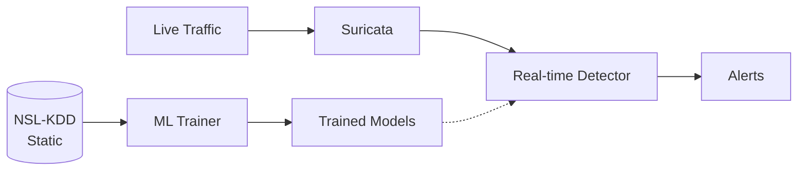

# Machine Learning in Network Security

## 📋 Table of Contents

1. [Quick Overview](#-quick-overview)
2. [ML Fundamentals](#-ml-fundamentals)
3. [NSL-KDD Dataset](#-nsl-kdd-dataset)
4. [Algorithms & Performance](#-algorithms--performance)
5. [API Usage](#-api-usage)
6. [Custom Datasets](#-custom-datasets)
7. [Real-time vs Static Training](#-real-time-vs-static-training)

---

## 🎯 Quick Overview

The Suricata ML-IDS uses **three machine learning algorithms** trained on the **NSL-KDD dataset** to detect network intrusions with **99.2% accuracy** in real-time.

### Key Facts
- **148,517 samples** of real network traffic
- **122 features** after preprocessing  
- **Binary classification**: Normal vs Attack traffic
- **Real-time detection**: <30ms latency
- **Industry benchmark** for intrusion detection research

---

## 🎓 ML Fundamentals

### What is Machine Learning?

Machine Learning teaches computers to recognize patterns, like learning to spot spam emails:

1. **Training**: Show examples → "This is spam" / "This is legitimate"
2. **Learning**: Computer finds patterns → Spam has "FREE", "URGENT" 
3. **Prediction**: Apply patterns to new data → "This looks like spam"

### Why ML for Network Security?

**Traditional Rules:**
```
IF packet_size > 1000 AND port = 80 THEN alert
```
❌ Can't detect new attacks, easy to bypass

**ML Approach:**
```
Learn normal behavior patterns, detect anomalies
```
✅ Detects unknown attacks, adapts to new threats

---

## 📊 NSL-KDD Dataset

### Overview
NSL-KDD is the **gold standard** dataset for network intrusion detection research.

| Category | Count | % | Examples |
|----------|-------|---|----------|
| **Normal** | 67,343 | 45.4% | Web browsing, email, file transfers |
| **Attack** | 81,174 | 54.6% | DoS, Probe, R2L, U2R attacks |
| **Total** | 148,517 | 100% | Real network connections |

### Attack Types

- **DoS (36.5%)**: Overwhelm server resources (SYN flood, Ping of Death)
- **Probe (1.3%)**: Scan for vulnerabilities (Port scanning, network mapping)  
- **R2L (16.2%)**: Gain unauthorized access (Password guessing)
- **U2R (0.04%)**: Escalate privileges (Buffer overflow, rootkit)

### Features (122 total)
- **Basic (9)**: Duration, protocol, service, bytes transferred
- **Content (13)**: Failed logins, compromised conditions, root access
- **Traffic (9)**: Connection counts, error rates
- **Host-based (10)**: Destination host statistics
- **Derived (81)**: One-hot encoded categorical variables

---

## 🧠 Algorithms & Performance

### 1. Decision Tree (98.8% accuracy)
```
Is packet_size > 500?
├─ YES: Is duration > 10s? → ATTACK
└─ NO: NORMAL
```
**Like**: A flowchart of yes/no questions  
**Best for**: Explainable decisions, fast predictions

### 2. k-Nearest Neighbors (98.9% accuracy)
```
New connection → Find 5 similar past cases → Vote on result
Example: 4 were normal, 1 was attack → Predict NORMAL
```
**Like**: "Show me similar cases and I'll predict based on them"  
**Best for**: Pattern similarity detection

### 3. Random Forest (~99.1% accuracy)
```
Creates 100 decision trees → Each votes → Average the results
Tree 1: NORMAL (85%), Tree 2: ATTACK (75%), ... → Final: NORMAL (87%)
```
**Like**: Ask 100 experts and average their opinions  
**Best for**: Robust general-purpose detection

### 4. Ensemble Model (99.2% accuracy) ⭐
```
Combines all three algorithms using "soft voting":
Decision Tree: 80% attack confidence
k-NN: 90% attack confidence  
Random Forest: 85% attack confidence
→ Ensemble: 85% attack confidence
```
**Like**: Medical diagnosis from 3 different doctors  
**Best for**: **Production use** - highest accuracy + reliability

### Performance Results

| Algorithm | Accuracy | Speed | Use Case |
|-----------|----------|-------|----------|
| Decision Tree | 98.8% | Fastest | Explainable AI |
| k-NN | 98.9% | Medium | Pattern matching |
| Random Forest | ~99.1% | Fast | General purpose |
| **Ensemble (All 3)** | **99.2%** | Fast | **Production** |

### Why Ensemble Works Better

**Team of Experts Approach:**
- Each algorithm has different strengths and weaknesses
- If Decision Tree makes mistake → k-NN and Random Forest correct it
- If one algorithm is uncertain → Others provide clarity
- **Soft voting** uses confidence levels, not just simple votes

**Real-world impact** (10,000 connections/hour):
- ✅ 9,920 correctly processed
- 🚨 ~50 real attacks detected  
- ⚠️ ~30 false alarms (manageable)

---

## 🔌 API Usage

### Train Models
```bash
curl -X POST "http://localhost:8002/train" \
     -H "Content-Type: application/json" \
     -d '{
       "dataset_filename": "nsl_kdd_sample.csv",
       "algorithms": ["decision_tree", "knn", "ensemble"],
       "target_column": "label"
     }'
```

### Real-time Detection
```bash
curl -X POST "http://localhost:8080/detect" \
     -H "Content-Type: application/json" \
     -d '{
       "features": [0,1,0,0,181,5450,...],
       "model_type": "ensemble"
     }'
```

**Response:**
```json
{
  "prediction": "attack",
  "confidence": 0.923,
  "threat_score": 8.7,
  "processing_time_ms": 12
}
```

---

## 🔄 Custom Datasets

### Requirements
Your CSV file must have:
- **Label column**: Named `label` with values `normal` or `attack`
- **Feature columns**: Numerical values (categorical auto-encoded)
- **Minimum size**: 1000+ samples recommended

### Quick Setup
```bash
# Option 1: Use preprocessing template
python3 data/custom_dataset_template.py

# Option 2: Manual preparation
cp your_dataset.csv data/datasets/custom_dataset.csv

# Test training
curl -X POST "http://localhost:8002/train" \
     -d '{"dataset_filename": "custom_dataset.csv", "algorithms": ["ensemble"]}'
```

### Example Format
```csv
duration,src_bytes,dst_bytes,protocol_tcp,label
0.5,1024,2048,1,normal
0.1,0,0,1,attack
2.3,4096,8192,0,normal
```

### Common Issues & Solutions

| Issue | Solution |
|-------|----------|
| "Label column not found" | Rename target column to `label` |
| "Invalid label values" | Map labels: `{'0': 'normal', '1': 'attack'}` |
| "Non-numeric features" | Use `pd.get_dummies()` for categorical encoding |
| Poor performance | Check class balance, feature relevance |

### Dataset Guidelines

| Size | Use Case | Training Time | Memory |
|------|----------|---------------|---------|
| < 10K | Testing | < 1s | < 50MB |
| 10K-100K | Development | 1-10s | 50-500MB |
| 100K-1M | Production | 10-60s | 500MB-2GB |
| > 1M | Large scale | 1-10min | 2GB+ |

---

## 🔄 Real-time vs Static Training

### Current System: Static Training



**How it works:**
1. **Training** (offline): Load dataset → Train models → Save to disk
2. **Detection** (real-time): Use pre-trained models → No updates

### Extending to Real-time Training

#### Option 1: Periodic Retraining (Recommended)
```python
# Retrain daily with accumulated Suricata data
def retrain_models():
    new_data = collect_suricata_data(hours_back=24)
    if len(new_data) > 1000:  # Minimum samples
        combined_data = pd.concat([existing_data, new_data])
        train_new_models(combined_data)
```

#### Option 2: Online Learning
```python
# Update models incrementally
from sklearn.linear_model import SGDClassifier

online_model = SGDClassifier()
online_model.partial_fit(new_features, new_label)
```

#### Option 3: Hybrid Approach
- Combine static models (stable) + online models (adaptive)
- Weighted ensemble: 80% static + 20% online

### Implementation Challenges

1. **Auto-labeling**: How to label real-time data?
   - Use Suricata alerts as ground truth
   - Manual validation for uncertain cases
   - Confidence-based filtering

2. **Performance**: Training affects detection speed
   - Asynchronous background training
   - Lightweight online algorithms

3. **Data quality**: Real-time data may be noisy
   - Validation and cleaning pipelines
   - Outlier detection

### Recommended Approach
1. Start with static training (current system)
2. Collect Suricata data for 24-48 hours
3. Implement periodic retraining (daily/weekly)
4. Optionally add online learning for high-confidence samples

---

## 💡 Key Takeaways

### For Students
- ML recognizes patterns in network traffic
- NSL-KDD provides real-world training data
- Ensemble methods achieve best performance (99.2%)
- Real-time detection possible with <30ms latency

### For Developers  
- Use ensemble model for production
- Monitor false positive rates
- System adapts to different datasets automatically
- API-first design enables easy integration

### For Security Professionals
- ML complements traditional signatures
- 122 features capture comprehensive attack patterns
- Continuous monitoring and validation required
- Explainable AI helps understand decisions

---

## 🔗 Related Documentation

- **[Quick Start Guide](quick-start-guide.md)** - Get the system running
- **[System Architecture](system-architecture.md)** - Technical deep dive
- **[API Reference](api-reference.md)** - Complete API documentation
- **[Performance Metrics](performance-metrics.md)** - Detailed benchmarks