# System Architecture

## 🏗️ Architecture Overview

The Suricata ML-IDS implements a hybrid detection approach combining signature-based and machine learning techniques:

```mermaid
flowchart TB
    NT[🌐 Traffic]
    
    subgraph IDS ["🔍 IDS"]
        S[Suricata<br/>:8000]
        EVE[(eve.json)]
        S --> EVE
    end
    
    subgraph ML ["🧠 ML Pipeline"]
        FE[Extractor<br/>:8001]
        MLT[Trainer<br/>:8002]
        RD[Detector<br/>:8080]
        FE --> MLT --> RD
    end
    
    subgraph CACHE ["💾 Cache"]
        Redis[(Redis<br/>:6379)]
    end
    
    subgraph STREAM ["📡 Streaming"]
        LS[Log Shipper]
    end
    
    subgraph SIEM ["🔎 SIEM"]
        ES[(Elasticsearch<br/>:9200)]
        KB[Kibana<br/>:5601]
        ES --> KB
    end
    
    subgraph TEST ["🚦 Testing"]
        TR[Traffic Replay<br/>:8003]
    end
    
    NT --> S
    NT --> FE
    TR --> NT
    EVE --> LS
    LS --> ES
    RD <--> Redis
    RD --> ES
    
    classDef ids fill:#ffebee,stroke:#c62828,stroke-width:2px
    classDef ml fill:#e8f5e8,stroke:#2e7d32,stroke-width:2px
    classDef siem fill:#e3f2fd,stroke:#1565c0,stroke-width:2px
    classDef stream fill:#fff3e0,stroke:#ef6c00,stroke-width:2px
    classDef cache fill:#f3e5f5,stroke:#7b1fa2,stroke-width:2px
    classDef test fill:#fff8e1,stroke:#f57f17,stroke-width:2px
    
    class S,EVE ids
    class FE,MLT,RD ml
    class ES,KB siem
    class LS stream
    class Redis cache
    class TR test
```



## 📦 Services Overview

| Service | Port | Description | Technology |
|---------|------|-------------|------------|
| **Suricata IDS** | 8000 | Signature-based intrusion detection | C, YAML rules |
| **Feature Extractor** | 8001 | Network feature extraction from PCAP | Python, Scapy |
| **ML Trainer** | 8002 | Model training with NSL-KDD dataset | Python, scikit-learn |
| **Real-time Detector** | 8080 | Live threat detection API | Python, FastAPI |
| **Traffic Replay** | 8003 | Network simulation and testing | Python, Scapy |
| **Log Shipper** | - | Real-time eve.json → Elasticsearch streaming | Python, asyncio |
| **Elasticsearch** | 9200 | Search and analytics engine | Java, Lucene |
| **Kibana** | 5601 | SIEM visualization and dashboards | JavaScript, React |
| **Redis** | 6379 | Caching and message queuing | C, in-memory |

## 🔄 Data Flow Architecture

```mermaid
sequenceDiagram
    participant NET as 🌐 Network
    participant S as 🔍 Suricata
    participant EVE as 📄 eve.json
    participant LS as 📡 Shipper
    participant FE as 🔧 Extractor
    participant RD as ⚡ Detector
    participant ES as 🔎 Elasticsearch
    participant KB as 📊 Kibana
    
    Note over NET,S: Traffic Ingestion
    NET->>S: Network packets
    S->>EVE: Event logs
    
    Note over EVE,ES: Log Streaming
    EVE->>LS: File monitoring
    LS->>ES: Bulk ingestion
    
    Note over NET,RD: ML Detection
    NET->>FE: Raw packets
    FE->>RD: Features (122)
    RD->>RD: Prediction (8-29ms)
    RD->>ES: Results
    
    Note over ES,KB: Visualization
    ES->>KB: Security data
    KB->>KB: Dashboards
```



## 🎯 API Interaction Flow

```mermaid
flowchart TB
    subgraph USERS ["👥 Users"]
        ANALYST[🔒 Analyst]
        DEV[👨‍💻 Developer]
        RESEARCHER[🎓 Researcher]
    end
    
    subgraph CORE ["🧠 Core APIs"]
        FE_API[🔧 Extractor<br/>:8001]
        ML_API[🎯 Trainer<br/>:8002]
        RT_API[⚡ Detector<br/>:8080]
    end
    
    subgraph SUPPORT ["🛠️ Support"]
        TR_API[🚦 Replay<br/>:8003]
        LS_API[📡 Shipper]
    end
    
    subgraph DATA ["📊 Data"]
        ES_API[🔍 Elasticsearch<br/>:9200]
        KB_DASH[📈 Kibana<br/>:5601]
        REDIS_API[💾 Redis<br/>:6379]
    end
    
    ANALYST --> KB_DASH
    ANALYST --> RT_API
    DEV --> FE_API
    DEV --> ML_API
    RESEARCHER --> ML_API
    
    FE_API --> ML_API
    ML_API --> RT_API
    RT_API --> REDIS_API
    RT_API --> ES_API
    LS_API --> ES_API
    ES_API --> KB_DASH
    
    classDef user fill:#e8f5e8,stroke:#2e7d32,stroke-width:2px
    classDef core fill:#e3f2fd,stroke:#1565c0,stroke-width:2px
    classDef support fill:#f3e5f5,stroke:#7b1fa2,stroke-width:2px
    classDef data fill:#ffebee,stroke:#c62828,stroke-width:2px
    
    class ANALYST,DEV,RESEARCHER user
    class FE_API,ML_API,RT_API core
    class TR_API,LS_API support
    class ES_API,KB_DASH,REDIS_API data
```



## 🔴 Redis Integration & Architecture

Redis serves multiple critical functions in the system:

### Performance Layer
- **Model Caching**: Stores trained ML models for fast access
- **Session Management**: Maintains user sessions and API states
- **Rate Limiting**: Controls API request rates per client
- **Metrics Storage**: Real-time performance and health metrics

### Inter-Service Communication
- **Message Queuing**: Asynchronous communication between services
- **Event Broadcasting**: Real-time alerts and notifications
- **Cache Invalidation**: Coordinated cache updates across services

### Configuration
```yaml
redis:
  host: redis
  port: 6379
  db: 0
  max_connections: 100
  timeout: 5s
```

## 🔍 Elasticsearch & Kibana Integration

### Data Streams
- **suricata-events-***: Real-time network events from eve.json
- **suricata-alerts-***: Security alerts and signatures
- **ml-detections-***: Machine learning predictions and confidence scores

### Kibana Dashboards
- **Security Overview**: Real-time threat landscape
- **ML Performance**: Model accuracy and prediction trends
- **Network Analysis**: Traffic patterns and anomalies
- **Alert Investigation**: Detailed threat analysis

### Index Templates
```json
{
  "suricata-events": {
    "mappings": {
      "@timestamp": {"type": "date"},
      "event_type": {"type": "keyword"},
      "src_ip": {"type": "ip"},
      "dest_ip": {"type": "ip"},
      "alert": {"type": "object"}
    }
  }
}
```

## 🏥 Monitoring & Health Checks

### Service Health Endpoints
- **Feature Extractor**: `GET :8001/health`
- **ML Trainer**: `GET :8002/health`
- **Real-time Detector**: `GET :8080/health`
- **Traffic Replay**: `GET :8003/health`
- **Elasticsearch**: `GET :9200/_cluster/health`
- **Kibana**: `GET :5601/api/status`

### Health Check Script
```bash
./scripts/demo.sh status
```

### Monitoring Metrics
- Service uptime and response times
- ML model performance and accuracy
- Elasticsearch cluster health
- Redis memory usage and connections
- Network traffic volume and patterns

## 🔧 Configuration Management

### Environment Variables
See [env.example](../env.example) for complete configuration options:

- **ML_ACCURACY_TARGET**: Minimum accuracy threshold (default: 0.90)
- **LATENCY_TARGET**: Maximum detection latency in ms (default: 100)
- **ELASTICSEARCH_HOSTS**: Elasticsearch cluster endpoints
- **REDIS_URL**: Redis connection string
- **SURICATA_RULES_PATH**: Custom rules directory

### Docker Compose Override
```yaml
# docker-compose.override.yml
version: '3.8'
services:
  ml-trainer:
    environment:
      - ML_ACCURACY_TARGET=0.95
      - DEBUG=true
```

## 🚀 Deployment Patterns

### Development
```bash
./scripts/demo.sh start
./scripts/dev-rebuild.sh ml-trainer  # Rebuild specific service
```

### Production
```bash
docker-compose -f docker-compose.yml -f docker-compose.prod.yml up -d
```

### Scaling
```yaml
services:
  realtime-detector:
    deploy:
      replicas: 3
    depends_on:
      - redis
      - elasticsearch
```

## 🔒 Security Considerations

### Network Security
- All services run in isolated Docker network
- No direct external access to internal services
- API authentication via environment variables

### Data Protection
- Elasticsearch indices with proper access controls
- Redis password protection in production
- Log rotation and retention policies

### Monitoring
- Real-time security event correlation
- Anomaly detection in system metrics
- Automated alerting for critical events
